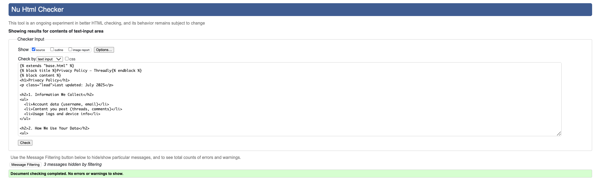

# 1. Introduction:

  

### Project Milestone 3: for Code Institute Full-Stack Development Program: Django Framework
The focus of this project was to implement the Django framework and Python on the back-end to create an intuitive and interactive blog-sharing platform. The website follows a Reddit-style structure, allowing users to register, log in, and manage their accounts with ease. Users can create, edit, and delete blog posts within various content categories, and interact with others by leaving comments and liking posts.

In line with the project scope, full CRUD (Create, Read, Update, Delete) functionality was implemented across user accounts, blog posts, and comments. Users maintain control over their contributions, with the ability to update or remove their content at any time. An admin panel is included to enable moderation and to allow users to send messages for support or to make feature suggestions.

### Login Details
Username: admin
Password: threadlyAdmin

## Table of Contents
1. [Introduction](#1-introduction)  
2. [Initial Wireframes](#2-initial-wireframes)  
3. [Features](#3-features)  
4. [Website Pages](#4-website-pages)  
5. [Bugs Resolved and Unresolved](#5-bugs-resolved-and-unresolved)  
6. [Testing and Deployment](#6-testing-and-deployment)  
7. [Conclusion](#7-conclusion)  
8. [Credits](#8-credits)  

# 2. Initial wireframes:    
The Threadly website was designed using a mobile-first approach, prioritising the user experience on smartphones and tablets before scaling up to larger screens. From the initial wireframes-crafted in Adobe Illustrator-the focus was on clean, intuitive layouts that translate smoothly across all devices. This method ensures that essential features are easy to access and navigate on mobile, while maintaining full responsiveness for desktop users. The result is a streamlined, consistent experience that adapts effortlessly to any screen size.

### Mockup screen shots:  
  
  
  
  
  
  

# 3. Features
## Navbar
Threadly features a minimalist navigation bar designed for simplicity and ease of use. Instead of multiple links, the nav bar includes just the logo—which doubles as a home button—and a log out button. This streamlined approach keeps the interface clean and user-friendly, aligning with the platform’s focus on a clutter-free, modern experience across all devices.

## Header
At the top left of the header section, there is the threadly (company) logo, which users can click to return to the home page at any time. The logo not only serves as a navigation link but also helps set the tone for the site’s design. It establishes the main colour theme, which includes green, gray, black, and white. These colours are carried throughout the website to create a consistent and professional look, ensuring that the branding is clear and visually appealing.

## Logo
The Threadly logo draws visual inspiration from the iconic Marvel logo, reimagined with the word Threadly to suit the platform’s unique identity. This bold, recognisable design choice helps immediately establish a sense of brand familiarity and cultural relevance—ideal for a Reddit-style social platform built around communities and conversations.

## Theme & color choice
* #ffffff (White)
*rgb(255, 0, 0) (Red)
*rgb(0, 0, 0) (Black)
* Threadly uses a bold and minimal colour palette of black, white, and red to create a clean, modern, and high-impact aesthetic. White provides clarity and space, black adds contrast and sophistication, while red introduces energy and draws attention to key elements. This combination reflects the platform’s vibrant, community-driven spirit while maintaining a sleek, user-friendly interface that appeals to its digital-native audience.

## Carousel
A carousel was implemented as a dynamic banner to highlight breaking news and featured blog posts within each category. This approach ensures that the most important and timely content is immediately visible to users, improving engagement and helping them quickly access updates relevant to their interests. It also allows multiple key stories to be showcased in a compact, visually appealing format without overwhelming the page layout.
  

## Page Titles
The page titles were designed with simplicity in mind and are center-aligned to create a clean, balanced layout. This straightforward approach helps users easily identify where they are on the site while maintaining a minimalist and cohesive design style.

## Like & Dislike Button
The Like & Dislike buttons were added to enable user interaction and feedback on blog posts and articles. This feature allows visitors to express their opinions in a quick, intuitive way, helping to highlight popular content and guide future improvements. It also encourages user engagement and makes the platform feel more dynamic and responsive to reader preferences.
  

## Comment on Blog Posts
The commenting feature allows users to engage directly with blog content by sharing their thoughts, questions, or feedback. This encourages community interaction and helps create a more dynamic and conversational environment around each post. By enabling comments, the platform fosters user engagement, builds trust, and adds value through diverse perspectives.
  

## Social Media
Social media is an important way to connect with users and the community around this project. It allows for sharing updates, announcements, and valuable insights while fostering engagement and collaboration. By including social media links, it becomes easier for users to stay informed, provide feedback, and share the project within their networks. This helps create a supportive and active community that contributes to the ongoing growth and success of the project.

## Footer
contact phone number, and email address, ensuring users can easily get in touch. It also features a quick navigation link back to the Home page, enhancing overall site usability. The inclusion of a concise copyright notice reinforces the brand’s professionalism and credibility. Designed to be simple and unobtrusive, the footer offers users access to key details without cluttering the interface, contributing to a clean and user-friendly browsing experience.
  

# 4. Website pages:
## Login Page
           
The page is designed to enable users to securely access their accounts by entering their username and password. It boasts a clean, modern layout with a prominent "LOG IN" header, a simple and intuitive form, and clear navigation options such as "REGISTER" or "create new account," guiding both existing and new users. A stylised world map in the background adds visual appeal, subtly reflecting the theme of global connection and reach. The consistent use of a red and white colour scheme enhances brand recognition and ensures readability, while the footer includes useful contact details and legal information. Overall, the design focuses on usability, security, and delivering a smooth user experience.

## Home Page
The Threadly homepage includes an interactive carousel showcasing various topics and categories. Users can browse through these options and click on any topic to enter dedicated chat rooms, fostering real-time conversations around their interests. This feature enhances user engagement by providing a simple and intuitive way to discover and join discussions, making it easy to connect with like-minded individuals on a wide range of subjects.

## Interative Chatting Catagories
Threadly offers users the ability to write and share blogs across multiple categories, creating a dynamic and engaging community platform. Each blog post allows other users to actively participate by liking, disliking, and commenting, fostering rich discussions and feedback. This interactive environment encourages users to express their ideas, share knowledge, and connect with others through meaningful conversations centered around diverse topics. The combination of blogging and real-time engagement helps build a vibrant community where every voice can be heard.

  
  
  
       

## Privacy Policy Terms of Service
Including a Privacy Policy and Terms of Service is important to inform users about how their data is handled and what rules apply when using this project. The Privacy Policy outlines what information may be collected, how it is used, and how it is protected. The Terms of Service define the rights and responsibilities of both the user and the project owner, setting clear expectations for usage, limitations, and liability. Providing these documents ensures transparency, builds trust with users, and helps protect both the developer and the user legally.

# 5. Bugs Resolved and Unresolved
Throughout the development process, I encountered several technical challenges. One notable issue was with GitHub — after facing difficulties merging branches due to conflicts and inconsistencies, I ultimately decided to create a new repository to continue development without disruption. Additionally, during deployment, I ran into persistent syncing issues between the frontend and backend, which resulted in repeated server errors, including HTTP status codes 500 (Internal Server Error) and 400 (Bad Request). These were eventually resolved through careful debugging, configuration checks, and ensuring proper data formatting on API requests.

When problems arose, my default approach was to first turn to AI tools for guidance and troubleshooting tips. I would also reach out to my Discord group for peer support and alternative perspectives. If the issue remained unresolved, I would then consult my tutor, who would inevitably provide the clarity or solution needed to move forward.

Despite these obstacles, the final outcome reflects a thoughtful balance of design and functionality, offering a secure and smooth login experience.and smooth login experience.

# 6. Testing and Deployment

  
  

## Light House
### Results:
  
  
Threadly has been tested using Google Lighthouse to ensure a high standard of performance and accessibility. On mobile , the site achieves an excellent score of 99/100 , with fast load times — First Contentful Paint at 0.5s and Largest Contentful Paint at 1.0s . The desktop version scores 72/100 , indicating room for improvement but still maintaining solid performance. Both versions receive strong marks for SEO (91/100) and Best Practices (89–93/100) , ensuring the site is well-structured and optimised for modern web standards

## CSS testing 
### Results:

No errors found when running the code through the W3C CSS Validator

## HTML Testing

    The code works well for an MVP, but it has some minor issues like lack of accessibility features, no image fallbacks, and inline styling which may affect scalability and maintainability. However, you may not want to change it now because it's functional, clear, and meets your current needs without overcomplicating things.

    This base template is clean, functional, and ideal for a working site. However, it has minor issues like hardcoded contact info, placeholder social links, and limited accessibility markup. Still, it’s best not to change it now because it provides a solid, simple foundation for your pages and meets your current needs without unnecessary complexity.

    This template works well for a basic forum-style feed, but it has a few minor issues: there's no form validation or feedback, no field for the post title despite it being shown later, and limited accessibility features. Still, it’s fine to leave it as-is because it’s simple, functional, and gets the core "Just Chatting" feature live quickly without overengineering.

    There are some minor issues-like inconsistent spacing, possible text truncation, or lack of hover effects—but overall, the layout is visually clear and user friendly. You may not want to change it now because it serves its purpose, displays categories cleanly, and keeps development fast and focused on core features.

    No errors

    No major errors

    This thread detail template is well-structured and clean. It shows the thread’s title, author, date, category link, body, reactions, and comments—all in a readable and user-friendly format. It also handles authentication for commenting properly. Unless you're adding new features, there's no urgent need to change it. It's already doing the job well.

# 7. Conclusion
Threadly is a dynamic discussion platform designed to bring users together around trending topics across a variety of categories, including Politics, Gaming & Sport, Music & Culture, and Just Chatting . The site offers a clean, intuitive interface that encourages engagement and conversation, with a strong emphasis on breaking news and community interaction.

Through this project, I've developed a deeper understanding of full-stack web development, authentication flows, and responsive design — all while navigating real-world challenges such as deployment issues and version control conflicts. Despite these hurdles, the successful launch of Threadly and the opportunity to onboard my first client, Searchlight Promotions , has made this journey incredibly rewarding.

As the platform evolves, future updates will focus on expanding user functionality, such as creating and commenting on threads, personal profiles, and enhanced moderation tools. For now, Threadly stands as a testament to what can be achieved through persistence, curiosity, and a little help from mentors and peers along the way.

# 8. Credits
This project would not have been possible without the invaluable support and guidance from the following people and tools.

## Mentors & Team
Spencer , my mentor at the Code Institute, who provided expert guidance and encouragement from start to finish.
My coursemates — Steve Powell, Robert Lewis, and Jordan Acomba — who formed a weekly study group every Sunday evening. Our discussions helped shape many aspects of this project and kept us motivated throughout the development process.
Shanbe Q. , my Python/Django tutor, who has supported me through weekly sessions to deepen my understanding of backend development.

## Tools & Resources
The following tools and platforms were instrumental in the design, development, and testing of Threadly :

Adobe Illustrator - For colour palette selection and UI design elements
Adobe Illustrator - For photo compressions and Generative fill
W3Schools - A go-to reference for HTML, and CSS syntax
Google - ll images used in this project are sourced from Google and are used for educational purposes only , in accordance with fair use guidelines. No copyright infringement is intended, and none of the images are used for commercial or monetary gain.
W3C Markup Validation Service – To validate HTML structure
W3C CSS Validation Service – To ensure clean and correct CSS
Lighthouse – Used for performance, accessibility, and SEO audits
Perplexity (AI Tool) – Assisted with general queries and learning concepts
Co-pilot - Assisted with coding in VS code
Stack Overflow – A trusted source for troubleshooting and problem-solving

I'm deeply thankful to every person and tool that played a part in bringing Threadly to life.
